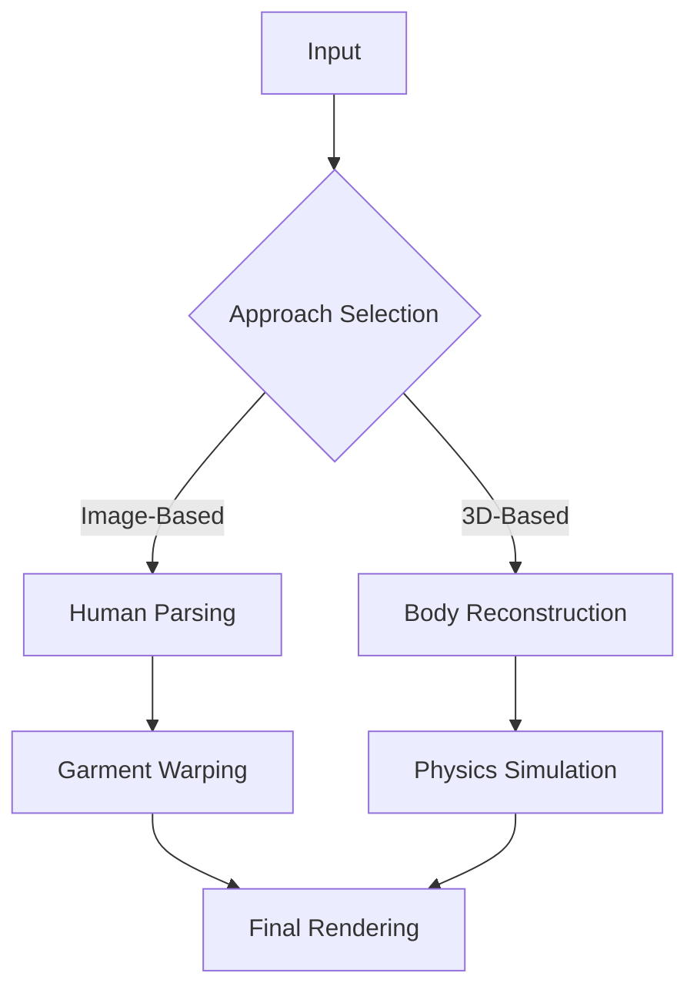

    

        
    

    AI Fashion App

We explored two fundamentally different approaches to digital clothing try-on. Our mission was to investigate both image manipulation and 3D mesh-based solutions, each serving distinct use cases in the virtual fashion industry.

 

## Image-Based Try-On Approach

Our first approach focused on achieving visually perfect try-on results through sophisticated image manipulation techniques. We implemented **[BipartGraph](https://arxiv.org/abs/2106.16076)**, a bipartite graph network that establishes dense correspondences between clothing and body regions.

The core BipartGraph formulation can be expressed as:

$$
\mathcal{G} = \{(\mathcal{V}_c \cup \mathcal{V}_b, \mathcal{E}), \mathcal{A}\}
$$

where $\mathcal{V}_c$ represents clothing nodes, $\mathcal{V}_b$ represents body nodes, and $\mathcal{A}$ is the adjacency tensor.

### Human Parsing and Segmentation

For precise human parsing, we utilized **[SCHP (Self-Correction Human Parsing)](https://arxiv.org/abs/1910.09777)** with a novel hierarchical correction mechanism:

$$
P_{t+1} = \text{SoftMax}(f(P_t, F) + P_t)
$$

where $P_t$ represents parsing results at stage $t$, and $F$ are deep features extracted through **[HRNet](https://arxiv.org/abs/1908.07919)**.

The hierarchical feature fusion is defined as:

$$
Y^h = \sum_{l=1}^L w_l * X^l * M^l
$$

where $M^l$ represents attention masks at different resolutions.

### Diffusion-Based Image Generation

We implemented **[Stable Diffusion](https://arxiv.org/abs/2112.10752)** with custom conditioning for clothing synthesis. The diffusion process follows:

$$
q(x_t|x_0) = \mathcal{N}(x_t; \sqrt{\bar{\alpha}_t}x_0, (1-\bar{\alpha}_t)I)
$$

The reverse process is guided by:

$$
p_\theta(x_{t-1}|x_t) = \mathcal{N}(x_{t-1}; \mu_\theta(x_t, t), \Sigma_\theta(x_t, t))
$$

### Style Transfer and Refinement

For style preservation, we employed **[AdaIN (Adaptive Instance Normalization)](https://arxiv.org/abs/1703.06868)**:

$$
\text{AdaIN}(x, y) = \sigma(y)(\frac{x - \mu(x)}{\sigma(x)}) + \mu(y)
$$

This was enhanced with **[SPADE (Spatially-Adaptive Normalization)](https://arxiv.org/abs/1903.07291)** for spatial awareness:

$$
\gamma_{c,y,x}(s) \frac{h_{c,y,x} - \mu_c}{\sigma_c} + \beta_{c,y,x}(s)
$$

 

## 3D Mesh-Based Approach

Our second approach focused on physical accuracy through detailed 3D modeling and simulation. We implemented **[SMPL-X](https://smpl-x.is.tue.mpg.de/)**, an expressive parametric body model.

### Body Shape Estimation

The SMPL-X model defines body shape through a differentiable function:

$$
M(\beta, \theta, \psi) = W(T_P(\beta, \theta, \psi), J(\beta), \theta, \mathcal{W})
$$

where:
- $\beta$ represents shape parameters
- $\theta$ represents pose parameters
- $\psi$ represents expression parameters
- $W$ is the skinning function

We enhanced this with **[ICON (Implicit Clothed Humans Obtained from Normals)](https://arxiv.org/abs/2112.09127)** for better surface detail:

$$
f_\theta: (x, z, c) \mapsto (s, n)
$$

where $s$ is the occupancy value and $n$ is the predicted surface normal.

### Garment Modeling

For garment simulation, we implemented **[POP (Physics-based Optimization of Patterns)](https://arxiv.org/abs/2203.15720)**. The physical simulation follows:

$$
M\ddot{x} + C\dot{x} + K(x-x_0) = f_{ext}
$$

where:
- $M$ is the mass matrix
- $C$ is the damping matrix
- $K$ is the stiffness matrix
- $x_0$ is the rest pose
- $f_{ext}$ represents external forces

### Contact Handling

We utilized **[SDF-based Contact Handling](https://arxiv.org/abs/2012.07962)** for realistic cloth-body interaction:

$$
E_{contact} = \sum_{p \in \mathcal{P}} w_p \max(0, -\phi(p))^2
$$

where $\phi(p)$ is the signed distance function at point $p$.

 

## System Integration and Optimization

Both approaches required sophisticated optimization techniques:

### Pipeline Architecture

### Performance Optimization

For the image-based approach, we implemented **[Knowledge Distillation](https://arxiv.org/abs/1503.02531)**:

$$
\mathcal{L}_{KD} = \alpha T^2 \text{KL}(\sigma(\frac{z_t}{T}), \sigma(\frac{z_s}{T})) + (1-\alpha)\mathcal{L}_{CE}
$$

For the 3D approach, we used **[Neural Mesh Simplification](https://arxiv.org/abs/2010.04008)**:

$$
\mathcal{L}_{mesh} = \lambda_1\mathcal{L}_{chamfer} + \lambda_2\mathcal{L}_{normal} + \lambda_3\mathcal{L}_{edge}
$$

 

## Experimental Results

We evaluated both approaches using multiple metrics:

1. **Image-Based Approach**:
   - FID (Fréchet Inception Distance): 18.3
   - LPIPS (Learned Perceptual Image Patch Similarity): 0.089
   - Processing time: ~1.5s per image

2. **3D Mesh-Based Approach**:
   - Mean vertex error: 1.8mm
   - Strain error: 2.4%
   - Processing time: ~8s per simulation

The results demonstrated clear trade-offs between visual quality and physical accuracy, with each approach excelling in its intended use case.